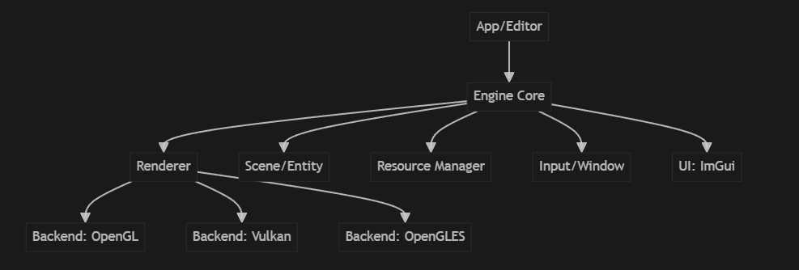

# Engine Framework
## 架构图

## 各模块设计
### 1. Engine Core（引擎核心）
负责生命周期管理、主循环、模块注册与调度。  
提供全局服务（如日志、配置、时间、事件分发）。  
### 2. Renderer（渲染器）
抽象接口：定义统一的渲染 API（如 DrawMesh、SetMaterial）。  
后端实现：OpenGL、OpenGLES、Vulkan 各自实现接口，便于切换。  
渲染流程：支持多 Pass、延迟/前向渲染、后处理等。  *(已支持MRT渲染)
Shader 管理：统一管理 shader 加载、编译、热重载。 (需要中间件支持着色器中的头文件包含和宏定义, 已支持) 
材质系统：支持不同材质类型（如 Phong、PBR），可扩展。  
Uniform/Descriptor 管理：屏蔽不同后端的差异。  
### 3. Scene/Entity（场景与实体）  
场景管理：支持多场景切换、保存、加载。  
实体-组件系统（ECS）：每个实体可挂载组件（如 Transform、MeshRenderer、Light）。  
层级关系：支持父子节点、变换继承。  
### 4. Resource Manager（资源管理）
统一接口：管理纹理、模型、shader、材质等资源的加载、缓存、释放。  （目前支持模型加载-材质处理有待完善）
异步加载：支持后台加载大资源。  
引用计数：防止资源泄漏。  
### 5. Input/Window（输入与窗口）
跨平台窗口：封装 GLFW/SDL，支持多平台窗口和输入。  
输入系统：键盘、鼠标、手柄等输入事件分发。  
### 6. UI: ImGui
调试 UI：集成 ImGui，提供实时参数调试、资源浏览、场景编辑等功能。  
可扩展面板：如材质编辑器、场景树、属性面板等。  
## 各模块实现要点
### 1. 渲染后端抽象
定义 IRenderer 接口，OpenGL/Vulkan 分别实现。  
通过工厂模式或运行时选择后端。  
### 2. 材质与 Shader 系统
材质类统一管理 shader、参数、贴图。  
支持通过 ImGui 动态调整材质参数。  
### 3. 场景与实体
采用简单 ECS 或传统 OOP 结构。  
支持基础组件：Transform、MeshRenderer、Light、Camera。  
### 4. 资源管理
资源唯一标识（如路径或 hash）。  
支持资源热重载（如 shader/贴图修改自动刷新）。  
### 5. ImGui 集成
提供调试面板、场景树、属性编辑器。  
支持运行时参数调整和可视化。  
## 跨平台与可扩展性
- 封装平台相关代码（如窗口、输入、文件系统）。
- 渲染后端可热切换（如启动参数选择 OpenGL/Vulkan）。  
- 资源、场景、渲染等模块解耦，便于后续扩展。  

## 主循环伪代码
```
GTinyEngine/
│
├─ include/           # 公共头文件
├─ source/            # 引擎核心代码
│   ├─ core/          # Engine Core
│   ├─ renderer/      # 渲染器与后端
│   ├─ scene/         # 场景与实体
│   ├─ resource/      # 资源管理
│   ├─ platform/      # 窗口与输入
│   └─ ui/            # ImGui集成
├─ 3rdParty/          # 第三方库
├─ Examples/          # 示例/测试项目
├─ resources/         # 资源文件
└─ TinyRenderer/      # 轻量渲染器（可选）
```

## 总结
目前设计如上述，但具体实现再来更新吧。
