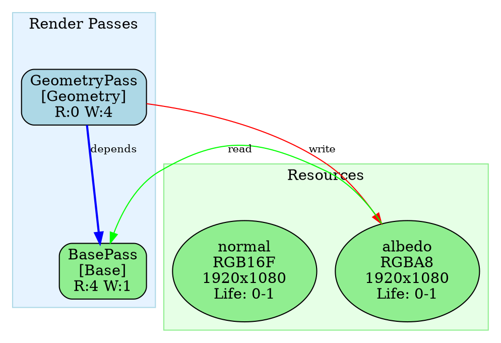

# RenderGraph Visualization Guide

## Overview

The RenderGraphVisualizer generates `.dot` files that can be viewed using Graphviz or online visualization tools. This helps visualize the render graph structure, including passes, resources, dependencies, and resource aliasing.

## Basic Usage

### 1. Generate Visualization File

```cpp
#include "framework/RenderPassManager.h"

auto& manager = te::RenderPassManager::GetInstance();

// Enable and compile RenderGraph
manager.EnableRenderGraph(true);
manager.CompileRenderGraph();

// Generate visualization file
manager.GenerateVisualization("rendergraph.dot");
```

### 2. View the Visualization

#### Option A: Online Viewer (Recommended)

1. Open https://dreampuf.github.io/GraphvizOnline/
2. Copy the contents of `rendergraph.dot`
3. Paste into the editor
4. Click "Generate" to view the graph

#### Option B: Graphviz Command Line

```bash
# Install Graphviz (if not already installed)
# Windows: choco install graphviz
# macOS: brew install graphviz
# Linux: sudo apt-get install graphviz

# Generate PNG image
dot -Tpng rendergraph.dot -o rendergraph.png

# Generate SVG (scalable vector graphics)
dot -Tsvg rendergraph.dot -o rendergraph.svg

# Generate PDF
dot -Tpdf rendergraph.dot -o rendergraph.pdf
```

#### Option C: VS Code Extension

Install the "Graphviz Preview" extension in VS Code, then open the `.dot` file.

## Graph Elements

### Pass Nodes (Blue Cluster)

- **Shape**: Rounded boxes
- **Color**: Varies by pass type:
  - Geometry: Light Blue
  - Background: Light Cyan
  - Skybox: Light Steel Blue
  - Base: Light Green
  - PostProcess: Light Pink
  - Shadow: Light Gray
  - UI: Light Yellow
  - Custom: Light Coral

**Information displayed**:
- Pass name
- Pass type
- Number of reads and writes

### Resource Nodes (Green Cluster)

- **Shape**: Ellipses
- **Color**: 
  - Normal resources: Light Green
  - Aliased resources: Light Yellow

**Information displayed**:
- Resource name
- Format (RGBA8, RGB16F, etc.)
- Dimensions (width x height)
- Alias information (if aliased)
- Lifetime (first use - last use)

### Edges

#### Dependency Edges (Blue, Solid)
- **Direction**: From dependency to dependent pass
- **Color**: Blue
- **Label**: "depends"
- Shows explicit pass dependencies

#### Read Edges (Green, Solid)
- **Direction**: From resource to pass
- **Color**: Green
- **Label**: "read"
- Shows which resources a pass reads

#### Write Edges (Red, Solid)
- **Direction**: From pass to resource
- **Color**: Red
- **Label**: "write"
- Shows which resources a pass writes

#### Alias Edges (Orange, Dashed)
- **Direction**: From aliased resource to actual resource
- **Color**: Orange
- **Style**: Dashed
- **Label**: "alias"
- Shows resource aliasing relationships

## Example Output

The generated `.dot` file will look like this:



## Advanced Usage

### Custom Visualization

You can also use the visualizer directly:

```cpp
#include "framework/RenderGraphVisualizer.h"
#include "framework/RenderGraph.h"

// Get compiled graph
auto& manager = te::RenderPassManager::GetInstance();
auto* executor = manager.GetGraphExecutor();
// Note: You may need to access the compiled graph differently

// Create visualizer
RenderGraphVisualizer visualizer;

// Generate dot file
visualizer.GenerateDotFile(*compiledGraph, "custom_graph.dot");

// Or get dot content as string
std::string dotContent = visualizer.GenerateDotContent(*compiledGraph);
```

## Tips

1. **Large Graphs**: For complex render graphs, consider using `rankdir=LR` (left-to-right) instead of `rankdir=TB` (top-to-bottom) for better readability.

2. **Filtering**: You can modify the visualizer to filter out certain types of edges or nodes for cleaner visualization.

3. **Customization**: The visualizer code can be customized to add more information or change colors/styles.

4. **Debugging**: Use visualization to debug dependency issues or resource aliasing problems.

## Troubleshooting

### Graph Not Generated

- Ensure RenderGraph is compiled before generating visualization
- Check that passes have been added to the manager
- Verify file write permissions

### Graph Too Complex

- Consider splitting into multiple graphs
- Filter out less important information
- Use different layout algorithms (neato, fdp, etc.)

### Colors Not Showing

- Ensure you're using a Graphviz viewer that supports colors
- Check that the color format is correct (quoted strings)

## Integration with Build System

You can add visualization generation to your build process:

```cmake
# In CMakeLists.txt
add_custom_command(
    TARGET YourTarget POST_BUILD
    COMMAND YourExecutable --generate-visualization
    COMMENT "Generating RenderGraph visualization"
)
```

---

*For more information about RenderGraph, see `rendergraph_analysis.md`*
